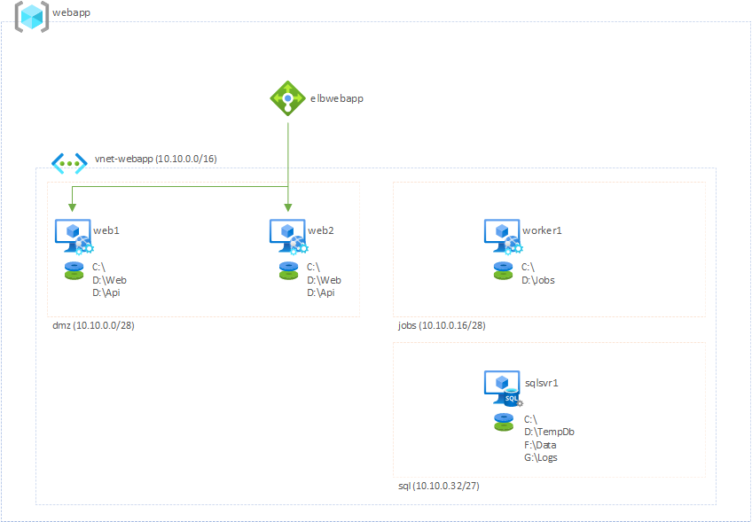

# Overview

During this OpenHack you will be tested on your understanding of the Microsoft Well-Architected Framework. You will demonstrate and practice a standardized process of conducting a Well-Architected assessment across all five of its pillars against a customer's workload.

Any resemblance to actual scenarios, issues, or pain points that you are currently facing with customers is _not_ coincidental. The definitions of the challenges that will be presented to you during this event are inspired by real cases.

> **IMPORTANT:** This OpenHack is intended to be difficult and will require an extremely large amount of energy from _all_ team members if you expect to succeed. It is encouraged that an assessment of each team member's strengths and weaknesses is made at the commencement of your event and that the requirements of each challenge is delegated based upon that assessment. It it highly encouraged that the members of the team work as efficiently as possible to complete each challenge in a timely manner. This OpenHack will require _every_ team member to give their full, undivided commitment.

## Context
Though it was once a very small community bank, Woodgrove Bank has experienced rapid growth throughout the past few decades. Their growth has resulted in launching market centers across multiple regions in the United States. Woodgrove Bank, because of its increased revenues and market reach, is now exploring expansion into other countries. In order to accomplish this goal, Woodgrove Bank realizes that some of the ways they conduct business today must change.

Some of these new approaches rely on Woodgrove Bank transitioning their operations to the cloud. Originally, it was feasible&mdash;fiscally and operationally&mdash;to manage a hot-cold distribution of services across two data centers. But, as they grow, the overall cost-value ratio has decreased considerably. Woodgrove Bank is convinced that moving to the cloud can help reduce these costs while continuing to increase value to its customers and the business.

Woodgrove Bank is also looking a refreshing their internally-built applications. Most of these applications were built when the bank first launch and have only experienced ad-hoc, piecemeal upgrades. Architecturally, the bank recognizes that these updates have had detrimental impacts to their applications over time. The applications seem to have degraded in performance, are more vulnerable to security threats, and they are less reliable and require much more time and effort from the SRE team.

The first application undergoing a rebuild is their primary customer portal and is owned by the _Customer Experience_ sector of the business. The customer portal traditionally has allowed customers to login and view balances, transfer money, pay bills, etc. The current redevelopment, however, is considered an MVP and only provides balance and transaction history. While some services may currently be unavailable in this release, Woodgrove Bank considers this acceptable as they wish to build correctly with a cloud-native approach against cloud services. They do not wish to build an on-premises architecture in a cloud environment. For the services that are lacking, customers may contact the bank directly. It is Woodgrove Bank's desire to quickly implement these features in their new application, but, again, they first want to ensure that they are adopting sound development practices.

> NOTE: The database contains customer transactions for the past 10 years. However, the current implementation of the customer portal only shows the posted transactions for the _last 60 days_.

Woodgrove Bank has a longstanding relationship with Microsoft and is a current enterprise customer with an established Enterprise Agreement. Your team is currently assigned to assist Woodgrove Bank with their cloud adoption efforts. You have been tasked to assess Woodgrove Bank's efforts in overall cloud adoption, and to specifically evaluate their primary web application.

Members of Woodgrove Bank's IT team are very capable of running advanced workloads on-premises&mdash;they've done so successfully for years. However, cloud concepts and cloud-native development are very new to them. The team members recognize their lack of maturity in these areas and are looking to Microsoft to provide guidance in proven practices and solid cloud design patterns. They also know very little regarding DevOps and deploying environments in a secure, repeatable fashion as, currently, all infrastructure is commissioned manually from a Hyper-V host.

Currently, on-premises, access to all resources are governed by a _least-privilege_ policy. Access to any resource must be manually granted to the appropriate users. Unfortunately, when Woodgrove Bank initiated this policy, access was granted by individual account at the resource level. This was manageable when Woodgrove Bank was a community bank who only employed a small number of IT administrators and software developers. Now, due to their explosive growth, including these teams, this practice is no longer feasible. Woodgrove Bank is asking your team to provide guidance in executing and maintaining security in the cloud. Given that they are a bank, Woodgrove Bank will need to be able to proactively monitor and report on its security posture.

Finally, not only is security a major concern, Woodgrove Bank wants to ensure that their cloud spend is fiscally responsible. They recognize that their migrations will include a shift from CapEx to OpEx business models, but they want to make sure that all spend is optimal. They need Microsoft to accurately assess the current workload, validate that the underlying service SKUs are adequate, and make any necessary recommendations for improving costs without sacrificing reliability or performance.

Business drivers for this effort include:

* Expansion while reducing overhead. While Woodgrove Bank is currently in a data center, they are looking to the cloud for expanding their IT while attempting to reduce operating costs.
* Innovation. Woodgrove Bank is taking this migration opportunity to update many of its legacy applications. The new applications will be built cloud-native to support current company growth and future technology innovations.

IT leadership's goals for Azure adoption include:

* Reduce costs of hosting and operating current workloads. All VMs on-premises are based on predefined images. IT needs greater flexibility in VM sizing that better accommodates the hosted workload. 
* Current on-premises implementation is a hot-cold configuration. When the primary site goes down, there is some latency and necessary reconfiguration to bring the second data center online. IT wishes to streamline this process and implement a full-distributed hot-hot environment across multiple regions, if possible.
* Security of resources is currently managed by individual Active Directory identities. IT needs to maintain the same least-privilege policy in the cloud, but needs a simpler way of managing access to services.
* Current deployments of on-premises VMs, while generally a simple process, are manual, time-consuming, and error-prone due to the heavy demands of IT resources. IT team members are typically balancing multiple support tickets at any given time. IT wishes to automate deployments as much as possible to alleviate any potential bottlenecks or misconfigurations.

Goals for developers, DevOps engineers, and SREs in the adoption include:

* Due to VMs sharing the same images for all applications, some applications are more performant that others. Development teams are seeking greater flexibility in the cloud in order to ensure that their end-users receive the best experience while using their applications.
* Development teams have been constrained to using only technologies that are available on-premises. This means development teams have traditionally been innovation-adverse due to the overhead that would be required for installing, configuring, and maintaining 3rd-party technologies. With cloud adoption, developers are interested in technologies that can simplify their workflow and empower them to innovate.

While each application and system being migrated into the cloud will undeniably be different due to different technologies and dependencies, this exercise will lay the foundation and help to instill a set of practices for moving the remainder of Woodgrove Bank's on-premises estate into Microsoft Azure.

As workloads are being transitioned to Azure, Woodgrove Bank has expressed the importance of application responsiveness to the customer. They have identified the following SLAs:

### SLAs

* Current load should support 10,000 users at any point in time.
* Page load timing:
  * < 1 sec - Excellent
  * 2-3 secs - Good
  * 3-5 secs - Acceptable
  * \> 5 secs - Unacceptable
* Application uptime should meet or exceed 99.99%
* Business Continuity/Disaster Recovery (BCDR):
  * Implement a hot-hot, multi-region deployment
  * RTO - 10 minutes
  * RPO - 1 hour

Woodgrove Bank is concerned that their current cloud architecture may not support this, which is one reason they have reached out to Microsoft for its help. Any architectural decisions going forward should revolve around the above KPIs and their SLAs.

## Architecture
Woodgrove Bank leverages a pair of web servers to currently host their customer-facing web application. All customers login to this application to view their account balances. In the future, the application will support additional services. This is currently a _live_, production workload. So any faulty changes can break production and hurt the bank's reputation with its customers. Therefore, downtime must be minimized.

**Your mission, should you accept it, is to re-architect the current deployment in accordance with the Microsoft Well-Architected Framework and meet the customer's goals while minimizing downtime to the application.**

The success of your team depends on your ability to perform the necessary architectural changes, meet customer's goals and objectives, and minimize the downtime of the application.

### Application Architecture
The customer portal is comprised of a few web services, background services and a database. All services reside on their own, independent VMs and share the database. All web requests pass through an external load balancer, which is configured to listen on ports 80 and 443. Additionally, it is configured with session affinity based on client IP and protocol. This architecture was chosen as it most closely mimics what the customer currently has on-premises. 

The web application is a standard, 3-tier implementation that is comprised of a separate front-end and backend developed with .NET Core 3.0, and the application leverages SQL Server 2014 SP3 for its database. The front-end and backend services reside on independent Application Pools in IIS on each web server. The front-end and backend services are deployed to _both_ web servers.

There is an additional server that hosts some background jobs. These jobs are fired upon a given schedule. The jobs are designed to process batches of transactions. When these jobs are executed, any outstanding/pending bank transactions are updated in their respective accounts.

> The current background job runs on a nightly schedule to process posted transactions. Normally, posted transactions would be gathered from a pending queue. For this OpenHack, the current background job simply creates between 1 and 15 random transactions (i.e. debit and/or credit) for each account, adds the transactions to the account's register, then updates the account's available balance.

The following diagram shows the application server architecture:

When moving their workload to the cloud, Woodgrove Bank chose virtual machine sizes that seemed appropriate and comparable to the virtual machines that were being used on-premises. Furthermore, Woodgrove has attempted to replicate their on-premises network configuration in their Azure tenant.

As you can see from the diagram above, all virtual machines have been attached to the same virtual network, which has three subnets. The IP addresses have been statically assigned to the virtual machines. The subnet and machine configurations are listed in the tables below.

#### Subnets
| Subnet     | Address Space | Total Available IPs | Purpose |
| :--------: | ------------- | ------------------- | ------- |
| **dmz**    | 10.10.0.0/28  | 11                  | Resources that are considered publicly accessible. |
| **jobs**   | 10.10.0.16/28 | 11                  | Background/utility resources.           | 
| **sql**    | 10.10.0.32/27 | 27                  | SQL and data resources.                 |

> NOTE: Total available IPs _do not_ include those IPs used by Azure internally.

#### Virtual Machines
| Server Name | OS | vCPUs | Memory (GiB) | Subnet | IP Address | Purpose |
| ----------- | -- | :---: | :----------: | :----: | ---------- | --------|
| **web1**    | Windows Server 2019 Datacenter | 8 | 16 | dmz | 10.10.0.4 | First load-balanced web server hosting front-end and backend of the site |
| **web2**    | Windows Server 2019 Datacenter | 8 | 16 | dmz | 10.10.0.5 | Second load-balanced web server hosting front-end and backend of the site |
| **worker1** | Windows Server 2019 Datacenter | 8 | 16 | jobs | 10.10.0.20 | Server that hosts timer jobs |
| **sqlsvr1** | Windows Server 2012 R2 Datacenter | 2 | 8 | sql |10.10.0.36 | SQL Server 2014 SP3 for the web site |

#### DNS Mappings
External FQDNs must be globally unique. Therefore, all public DNS host names have a six-character alphanumeric code appended in the format below.
| DNS                     | Mapping |
| ----------------------- | ------- |
| woodgroveelb######      | External load balancer |
| woodgroveweb1######     | Web server 1    |
| woodgroveweb2######     | Web server 2    |
| woodgroveworker1######  | Worker server 1 |
| woodgrovesqlsvr1######  | SQL server 1    |
| storwoodgroveweb######  | Storage used by web servers |
| storwoodgrovesql######  | Storage used by SQL server  |

### Active Directory

Woodgrove Bank currently has an existing Azure subscription and Azure Active Directory tenant. They have already configured AD Connect and synchronized users to the cloud. These users should be leveraged for securing cloud resources.

**NOTE:** Active Directory will report that AD users are _cloud only_. However, you are to assume that these users were indeed synchronized from Woodgrove Bank's on-premises Active Directory.

## Cheat sheet
In this section, you will find a list of hints to help you through the Well-Architected Framework OpenHack.

### Obtaining the credentials of your team environment

1. Navigate to the **OPEN HACK ENVIRONMENT** tab.
2. The usernames and passwords provided can be used to access your OpenHack's Azure subscription.

### Connecting to the public-facing application

1. Open the [Azure portal](https://portal.azure.com).
2. Use a username/password combination found in your **OPEN HACK ENVIRONMENT** tab to login.
3. Search for the resource **elb-eastus-web**. This is your external load balancer. The _public_ IP address of the load balancer can be used to access the web application in the OpenHack. 
### Logging in to the web application

You can login to a fictitious customer's bank account using the following credentials:

| User | Acct No. | Username | Password |
| ---- | -------- | -------- | -------- |
| Daniel Melamed | 686847363244 | dmelamed3244 | (Pass@word)1234! |
| Ting Niu       | 815571025629 | tniu5629     | (Pass@word)5678! |

### Connecting to the servers

1. Open the [Azure portal](https://portal.azure.com).
2. Use a username/password combination found in your **OPEN HACK ENVIRONMENT** tab to login.
3. Search for the VM by its name listed in the table above. 
4. Use a Remote Desktop Connection (RDP) to connect to the server you choose by using its Public IP address.

The _administrator_ credentials for the virtual machines are:
* Username: **cloudadmin**
* Password: **(Pass@word)1234!**

### Logging in to the database

You can use SSMS on the database server itself, or you may use a local copy of SSMS for connecting to the application's database.

The database credentials are the following:

| Username | Password | Description |
| -------- | -------- | ----------- |
| cloudsqladmin | (Pass@word)1234! | SQL Administrator |
| webapp   | S0m3R@ndomW0rd$  | Account used by web application |

## References