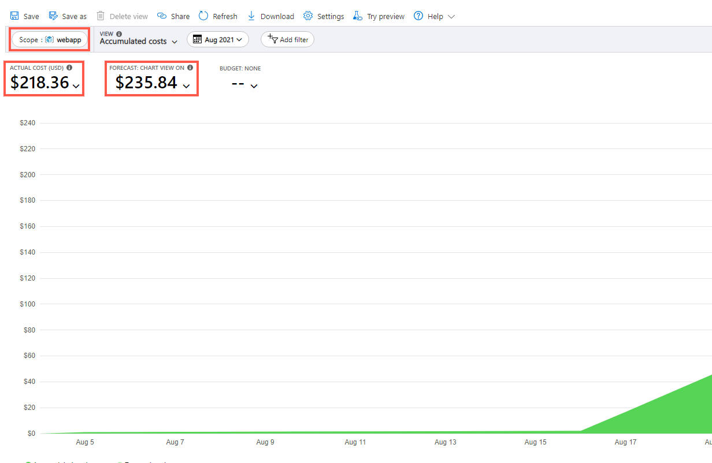

# Guide: Assess the environment

## Success Criteria

* The attendees will need to be able to describe each pillar of the Microsoft Azure Well-Architected Framework (e.g. Cost Optimization, Operational Excellence, Performance Efficiency, Reliability, and Security) along with each respective pillar's core principles.
* The attendees should have a list of all components in the architecture and demonstrate that they have researched the configuration. This list should _not_ just include what's shown in the architecture diagram. Instead, it should also include components such as:
    * NSG configurations
    * shared blob storage
    * RBAC configurations
    * Azure AD configurations
    * how the application is configured on the VMs (connection strings, file locations, IIS, etc.)  
* Attendees should be able to identify many of the items listed in the "Sample_Issues.docx" document located in the coach's resources tab. You can leverage the document as a reference.

>_Completeness of the above two inventories is absolutely essential as it will serve as a compass for the team moving forward through remaining challenges._

* Attendees should demonstrate how to perform a _Cost Analysis_ on the current subscription.
* Attendees should add tags to the resources in the current workload based on department and demonstrate how to filter costs based on the department.
* Attendees should demonstrate how to use the Azure Pricing Calculator to estimate costs of future workloads.
* Attendees should demonstrate and document load testing of the application.
* Attendees should demonstrate and document stress testing of the application. At what point does the application fail?

## Hints/Suggestions

* While it is _ideal_ that all architects know the Microsoft Azure Well-Architected Framework, given the time constraints of the OpenHack, this may not be entirely possible. It may be a better use of the team's time for the attendees to split up the pillars among themselves. Each pillar can then be researched independently and team members can inform their colleagues on the pillars and their respective core principles.
* One customer requirement identified in the _Overview_ is that only users who have a Woodgrove Bank AD account&mdash;no guest user&mdash;should have access to Azure resources. This should be noted by the team.
* Filtering workloads for the _Cost Analysis_ tool can be accomplished using tags. The department for the current workload was mentioned in the OpenHack overview. The owner of this workload is the "Customer Experience" business sector, or department.
* Attendees should know how to conduct a performance test. There are a number of free tools available. However, if they do not have a preferred tool, it is recommended that they familiarize themselves with the basics of k6. The sample script found in the _Cheat sheet_ section is heavily documented. Team members should be encouraged to save the script and edit it as needed based on their preferred stages and thresholds.

## References

* <a href="https://docs.microsoft.com/azure/architecture/framework/" target="_blank">Microsoft Azure Well-Architected Framework</a>
    * <a href="https://docs.microsoft.com/azure/architecture/framework/cost/" target="_blank">Cost Optimization</a>  (<a href="https://docs.microsoft.com/azure/architecture/framework/cost/overview" target="_blank">Core Principles</a>)
    * <a href="https://docs.microsoft.com/azure/architecture/framework/devops/overview" target="_blank">Operational Excellence</a> (<a href="https://docs.microsoft.com/azure/architecture/framework/devops/principles" target="_blank">Core Principles</a>)
    * <a href="https://docs.microsoft.com/azure/architecture/framework/scalability/overview" target="_blank">Performance Efficiency</a> (<a href="https://docs.microsoft.com/azure/architecture/framework/scalability/principles" target="_blank">Core Principles</a>)
    * <a href="https://docs.microsoft.com/azure/architecture/framework/resiliency/overview" target="_blank">Reliability</a> (<a href="https://docs.microsoft.com/azure/architecture/framework/resiliency/overview" target="_blank">Core Principles</a>)
    * <a href="https://docs.microsoft.com/azure/architecture/framework/security/overview" target="_blank">Security</a> (<a href="https://docs.microsoft.com/azure/architecture/framework/security/security-principles" target="_blank">Core Principles</a>)
* <a href="https://docs.microsoft.com/azure/cost-management-billing/costs/quick-acm-cost-analysis?tabs=azure-portal" target="_blank">Quickstart: Explore and analyze costs with cost analysis</a>
    * <a href="https://docs.microsoft.com/azure/cost-management-billing/costs/cost-analysis-common-uses#view-costs-for-a-specific-tag" target="_blank">Viewing costs based on tag</a>
* <a href="https://www.blazemeter.com/blog/performance-testing-vs-load-testing-vs-stress-testing" target="_blank">Performance Testing vs. Load Testing vs. Stress Testing</a>
* <a href="https://docs.microsoft.com/azure/active-directory/enterprise-users/users-restrict-guest-permissions" target="_blank">Prevent inviting guests to AD tenant</a>

## Step-By-Step

### Included Resources

Each OpenHack team should have the following resources automatically deployed in their Azure subscription and Azure DevOps tenant.

#### Azure Subscription

The Azure subscription should currently have a single resource group (`webapp`) with the following 25 resources deployed. Team members should have _Owner_ privileges in the subscription.

> NOTE: Disk names will be different than what is shown in the image.

#### Azure DevOps

The team's Azure DevOps tenant should have two projects&mdash;_Bicep_ and _Portal_. Team members should have _Project Collection Administrator_ privileges.

##### Confirm _Bicep_ Repository

Bicep should have a single repository named _bicep_.

1. Click on the _Bicep_ project.
2. On the left menu, click on _Repos -> Files_
3. At the top of the files screen, click the dropdown next to _bicep_ and confirm that only one repository was created.

##### Confirm _Portal_ Repositories

Portal should have two repositories: 1) _processor_ and 2) _web_.

1. Click on the _Portal_ project.
2. On the left menu, click on _Repos -> Files_
3. At the top of the files screen, click the dropdown next to _web_ (or _processor_) and confirm that two repositories were created.

### Describing the Microsoft Azure Well-Architected Framework

Participants will need to review the documentation <a href="https://docs.microsoft.com/azure/architecture/framework/">Microsoft Azure Well-Architected Framework</a>. On this page, you will find general overviews of each of the pillars.

Participants will also need to articulate each of the pillar's core principles. The principles are scattered in the documentation, but the direct links are provided below.

1. <a href="https://docs.microsoft.com/azure/architecture/framework/cost/overview" target="_blank">Cost Optimization</a>
2. <a href="https://docs.microsoft.com/azure/architecture/framework/devops/principles" target="_blank">Operational Excellence</a>
3. <a href="https://docs.microsoft.com/azure/architecture/framework/scalability/principles" target="_blank">Performance Efficiency</a>
4. <a href="https://docs.microsoft.com/azure/architecture/framework/resiliency/principles" target="_blank">Reliability</a>
5. <a href="https://docs.microsoft.com/azure/architecture/framework/security/security-principles" target="_blank">Security</a>

### Identifying issues in current implementation

The current customer implementation has quite an extensive number of gaps. A document (_Sample_Issues.docx_) has been included under the _Resources_ tab. You will need to compare the team's findings against the document. The document, by no means, is to be considered exhaustive. However, it should provide a more-than-adequate starting point for your reference.

Additionally, the team may find it useful to install the <a href="https://marketplace.visualstudio.com/items?itemName=bencoleman.armview" target="_blank">ARM Template Viewer</a>, an extension to VS Code that maps out resources from an ARM template. Installing this extension and viewing the ARM template produced by the Bicep definition can assist the team in inventorying the Azure resources and how they're connected.

### Performing a Cost Analysis on the current architecture

Participants will need to demonstrate how to perform a cost analysis on the current deployment. This can be done a couple of ways. Below is just _one_ way to accomplish this task.

1. While logged in to the Azure Portal and having the _webapp_ resource group open, click on _Cost Analysis_ in the left-hand menu.  

2. This will navigate you to the cost analysis page that is specific to this specific resource group (see picture below).

Participants will need to show where to locate "Actual Costs" and "Forecasted Costs."

> NOTE: Your reported costs may be difference than what is shown in the picture.

### Tagging resources to filter costs based on department

The customer is wishing for the ability to identify which resources belong to which department so that the IT department can conduct chargebacks. As stated in the _Overview_, these resources belong to the customer's _Customer Experience_ department.

The team will need to add a custom tag to the resource group.

> **IMPORTANT:** The following steps show you how to add tags manually via the Azure portal. This is acceptable for this challenge. However, the team will need to add the tags via the Azure Bicep scripts for future challenges.

1. Within the _webapp_ resource group, click on _Click here to add tags_ at the top of the page.

2. In the _Edit tags_ blade, the team can enter something to the effect of the following:  
    1. **Name:** _Department_
    2. **Value:** _Customer Experience_
3. The Tags should include the tag you just created.

4. Select all resource in the resource group, then click on _Assign tags_ at the top.

5. Add the same tag as you added in step 2.

Once the resource group is appropriately tagged, the team will need to filter the cost analysis tool to only show resources for this department. Below is a method for reporting costs from the subscription blade.

1. In the Azure portal, type _Subscriptions_ in the top search bar and click the subscriptions icon (with the key).
2. On the subscriptions blade, click on the appropriate subscription for the OpenHack.
3. From the subscription overview blade, like the resource group blade, click on the _Cost analysis_ link in the left-hand menu.
4. On the cost analysis blade, in the top header:
    1. Change the _View_ from "Accumulated costs" to "Invoice details"
    2. Change the _Time Period_ to "This month" or "Last month"
    3. Add a filter with the options: _Tag_, _Department_, _Customer Experience_  
    

> (NOTE: If the team has recently added the tag, it may take a few minutes for the cost analysis blade to show it as an option as this requires a data refresh from Azure. Don't waste too much time on waiting for this option to become available. The important thing is to ensure that the team knows how to do this.)

### Calculating budgets using the Azure Pricing Calculator

Given some resource requirements, teams should be able to demonstrate how to use the Azure Pricing Calculator for predicting costs of future workloads. The Azure Pricing Calculator can be found <a href="https://azure.microsoft.com/en-us/pricing/calculator/" target="_blank">here</a>.

Additionally, the team should demonstrate exporting the generated estimate to an Excel file.

### Articulating the differences between various performance testing

The team should know the differences between performance, load, and stress testing the application.

**Performance testing**, given an understanding of general application usage/consumption, is testing performed against the workload with that specific load. For example, if it has been determined that an application serves 10,000 requests each minute, a performance test will simply report how well the application responds with that load.

**Load testing** is testing against an application with varying loads to see how the application will respond. Load testing is used for determining how the application will scale when load increases and decreases.

**Stress testing** tests the _maximum_ load an application environment can withstand based on the current scale configuration before it becomes unstable. Stress testing is useful for determining when additional resources, including financial, are needed to ensure business continuity.

### Load testing the application

A sample k6 script for conducting performance tests against the environment is included under the team's _Resources_ tab in the Opsgility portal. Included with the script is a document that describes how to execute the script with either the k6 CLI or the k6 Docker container. Finally, the script itself has comments throughout to show teams what to update prior to execution. Therefore, instructions will not be included here.

In this challenge, teams will need to perform two types of tests:

1. Performance test configured with the stated business SLAs
2. Stress test to determine at what load the current architecture will fail

For all tests, the team will first need to update URL to the bank's external load balancer (line 10). Additionally, the team will need to include one of the usernames (and its respective password) listed in the _Overview_ so that the load test script can authenticate as a bank user.

#### Performance Test Configuration

For the first test and assuming that the team is using k6, there will be two sections that the team will need update.

The _stages_ section of the script (lines 33-38) defines gradual stages in which load is introduced or reduced on the application. By default, there are three stages with a minute each. Over the first two minutes, users are introduced in two stages&mdash;100 users total, 250 users total, then 500 users total. During the final minute, the 500 users are reduced to 0. This is to simulate a small, but realistic, gradual load on the application and then remove it. The removal stage is key because it will demonstrate how well the application frees or recycles unused resources.

The _threshold_ section configures particular KPIs that should be monitored. By default, there are two thresholds specified. The first threshold sets three data points to monitor for the duration of each http request (_http_req_duration_). The data points are the following:

* Any request's _maximum_ duration should not exceed 10 seconds.
* At 90% of total load (in our default case, 180 total users (450 * .9)), a request should not exceed 2 seconds.
* At 95% of total load (475 total users), a request should not exceed 5 seconds.

> NOTE: The duration is specified in milliseconds. Therefore, 10,000 milliseconds is 10 seconds. Additionally, it is expected that, as load increases, response time should increase. Therefore, while 90% of total load is allowed to require 2 seconds, 95% of total load is allowed to require 5 seconds for a full page load.

The final threshold states that, of all HTTP requests, only up to 10% are allowed to fail.

The customer has specified that the load should support up to 10,000 users at any point in time. Additionally, the customer has stated the following page load timing:

* < 1 sec - Excellent
* 2-3 secs - Good
* 3-5 secs - Acceptable
* \> 5 secs - Unacceptable

While you _could_ configure the script to test at 10,000 users, it is best to start with a smaller load to see how the application will initially respond.

For the first run, teams should simply run the script as it's currently configured to see how well the application responds under some basic load.

Running the script with the default configuration will require approximately 4 minutes (1 minute per stage) and should produce some results similar to the following (your response times may differ).

Again, your results may differ from the image. However, based on the image above, you can note the following key metrics:

##### General overview of results

* **(1)** The test took approximately 4 minutes 30 seconds to complete. While stages are configured to last a minute each, k6 also records how long it takes for a request to complete. Therefore, by default, while in the last minute it _sent_ some requests (500 down to 0 for the last stage), k6 waits until all requests have either returned/completed or the timeout has been reached. By default, k6's timeout is 30 seconds.
* **(16)** In that 4 minutes of testing, a total sum of 15,030 requests were sent to the system.
* **(15)** Of those 15,030 requests, 5.34% failed. Because our configured maximum for failed requests is set to 10%, our threshold wasn't met.
* **(2)** Additionally, because we have the script configured to track which paths failed, we can see that 89% of requests to the home page were successful and 98% of login attempts were successful.

##### Performance-specific results

First, keep in mind the SLAs that the business specified for performance. If needed, refer to them above. With the SLAs in mind, review the following.

Overall:

* **(11)** The _average_ page load duration across all tests was 3.08 seconds. Acceptable SLA.
* **(12)** The _maximum_ page load duration across all tests was 1 minute. Failed SLA.
* **(13)** At 90% maximum load (450 users), the _average_ load duration across all tests was .88023 seconds. Excellent SLA.
* **(14)** At 95% maximum load (475 users), the _average_ load duration across all tests was 2.48 seconds. Good SLA.

Given an understanding of how our application responded overall, let's drill down into the individual pages to determine what pages may need addressing for performance.

Home Page:

* **(3)** The _average_ page load duration for the Home Page was 6.539 seconds. Failed SLA.
* **(4)** The _maximum_ page load duration for the Home Page was 1 minute (60.007 seconds). Failed SLA.
* **(5)** At 90% maximum load (450 users), the _average_ load duration for the Home Page was 45.31 seconds. Failed SLA.
* **(6)** At 95% maximum load (475 users), the _average_ load duration for the Home Page was 1 minute (60.002 seconds). Failed SLA.

Login Page (and form submission):

* **(7)** The _average_ page load duration for the Login Page was 1.860 seconds. Good SLA.
* **(8)** The _maximum_ page load duration for the Login Page was 1 minute (60.005 seconds). Failed SLA.
* **(9)** At 90% maximum load (450 users), the _average_ load duration for the Login Page was 1.248 seconds. Good SLA.
* **(10)** At 95% maximum load (475 users), the _average_ load duration for the Login Page was 1.658 seconds. Good SLA.

Given these results, we can determine the following basic points:

* The infrastructure encountered a 5.34% failure rate with only 500 users. If you were to view the logs, you would see that many of the failures were due to a "request timeout." In other words, the system became unresponsive. It would be safe to surmise that the infrastructure, as it is currently, could not adequately handle 10,000 simultaneous users. What we don't know, however, is what actually failed. Did the web servers fail? Did the load balancer fail? It may be advantageous to replace the target URL in the script that is currently pointing to the load balancer with a URL to an individual VM. In other words, reduce variables.
  > NOTE: The tests will also fail against an individual VM due to too many requests. Therefore, this may indicate that additional VMs need to be instantiated to handle desired capacity and performance.
* The Login Page was much more responsive than the Home Page. This is to be expected as the Home Page has many more images and, therefore, much more data is being read and transferred. k6 doesn't cache data between requests. One way to increase performance of the application is to leverage a CDN or, at minimum, configure IIS for output caching (see <a href="https://docs.microsoft.com/iis/manage/managing-performance-settings/configure-iis-7-output-caching" target="_blank">documentation</a> for reference).
* What was intended to be a basic load test, in fact, became a stress test. The load test, as it is currently configured, rendered the system inoperable.

As the team moves forward with the challenges, they will need to add/modify stages and targets. Again, the end goal is to architect a system that supports 10,000 simultaneous users with a response time of less than 5 seconds.
